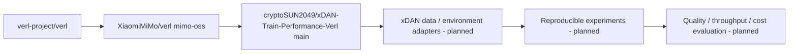

# xDAN-Train-Performance-Verl / 项目初始化设计

状态：用户明确要求“帮我建立”，基于已审阅专项HTML中的fork长期方案进入执行。日期2026-09-28。

## 目标
创建 XiaomiMiMo/verl 的具名fork，建立本地主目录与隔离worktree，保留训练基线和来源关系，归档研究、教程及P0计划。暂不执行GPU训练、不改训练算法。

## 架构

## 文件改动
- README.md：增加xDAN入口，保留原小米及verl说明。
- .gitignore：排除本地.Codex worktrees，防止双重扫描与误提交。
- docs/feat-project-bootstrap/：专项HTML、源证据、教程、设计、P0与upstream manifest。
- tasks/：任务计划和交接。
- 9个Python文件：只做Ruff格式化，AST前后完全一致。
- 2个上游tutorial notebooks：修复导入排序、无用import、过长注释；对有意sys.path设置后的导入采用局部E402注释。不得修改输出或metadata。

## 为什么包括lint修复
原始SHA在当前Ruff上报8项notebook lint问题、9个Python文件格式不符。用户要求每次push前ruff check .与ruff format --check .均通过；采用最小修复，不放宽全局规则、不跳过门禁。

## API/数据契约
无新增运行时API。upstream-manifest.json记录三层仓库来源、固定模型/数据revision、子模块SHA与训练未验证状态。P0定义未来转换器的输入/输出与验收，不假装当前已有adapter。

## 验收
1. GitHub fork parent为XiaomiMiMo/verl，source为verl-project/verl。
2. main保留mimo-oss祖先；原始mimo-oss分支保留。
3. Python格式化文件AST不变；notebook输出/metadata不变，代码diff人工核验。
4. ruff check .和ruff format --check .都通过，git diff --check通过。
5. HTML本地文件存在，内部锚点与链接检查通过，页面打开；训练不宣称已执行。
6. 推送后远端main SHA等于本地提交，仓库默认分支切到main。
