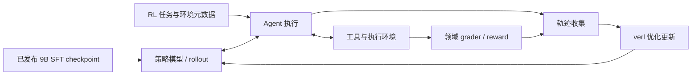

# MiMo × verl 技术报告：设计与事实边界

日期：2026-09-28。状态：用户明确要求制作完整 HTML 后进入实施；最终报告已实现并完成浏览器验收。

## 目标

回答“小米是否开源了一套基于 verl 微调小模型的完整方案”，形成可离线打开、分享和打印的中文 HTML 技术研究报告。面向技术负责人及训练工程师，先给结论，再提供架构、代码证据和复现边界。

初步结论：它是一套以已发布 SFT 模型为起点的 Agentic RL 配套资源。不得将它描述成从基础模型到全部生产训练结果的一键复现包。

## 补充核实：官方确实报告了 9B RL 实验结果

[技术报告](https://huggingface.co/XiaomiMiMo/MiMo-V2.6-Pro-RL/blob/main/MiMo_V2_6_technical_report.pdf) §7.2、印刷页 34–36、表 6/7 明确报告从同一个 9B SFT checkpoint 出发，分别进行 Code/Cyber/General/Visual 的 GRPO 训练；音乐另有内部评测结果。因此不能将此前“模型卡仅列 SFT 成绩”推断成“官方没有 RL 成绩”。

表 6 的 SFT → RL：SWE-bench Verified 61.1 → 66.2；SWE-bench Pro 44.6 → 47.6；MiMo Code mini 51.6 → 59.9；MiMo Cyber mini 31.3 → 47.0；AutomationBench 30.3 → 33.1；Terminal Bench 2.1 37.1 → 52.8；Toolathlon-Verified 35.2 → 38.0；OfficeQA Pro 19.5 → 24.8；JobBench 18.3 → 25.2；MiMo General mini 62.2 → 70.6；MiMo Visual Coding mini 64.0 → 72.4。Code/Cyber 用 avg@3，其余用 avg@1。音乐正文另报告 45.7 → 52.5。

这些是领域分别训练的 checkpoint，不是同一个五域混合训练后的 9B 模型。表 6 Code 为 single-harness；表 7 是独立的 multi-harness 实验，七 harness 平均 SWE Verified 62.3 → 65.7、SWE Pro 44.4 → 46.5、MiMo Code mini 53.1 → 59.0。最终 HTML 应设专门的“已有实验成绩”章节，并区分官方自报结果、公开最终权重状态、独立复现与本地实测。当前未核实每个领域 RL 最终 checkpoint 是否公开，也未执行训练。

## 已核实事实与来源

1. [训练仓库](https://github.com/XiaomiMiMo/verl)：`mimo-oss` 分支；README 称基于 verl 0.9.0.dev 增加五类 RL 环境的复现代码。Code、Cyber、General、Visual、Music 分别有训练入口与 env.example。
2. [模型卡](https://huggingface.co/XiaomiMiMo/MiMo-V2.6-Distill-Qwen-9B)：Qwen3.5-9B 在 MiMo 生成数据上进行 SFT，发布 checkpoint 作为 Agentic RL 研究起点。模型卡成绩属于 SFT checkpoint。加权 SFT 数据混合为 77.4B total tokens / 27.2B loss-bearing tokens，不能混同于本次公开 RL 任务集。
3. [任务集](https://huggingface.co/datasets/XiaomiMiMo/MiMo-V2.6-RL-oss)：五个子集，含任务 prompt、奖励及环境相关元数据。文件页总大小显示 12.1 GB；包含 general 目录、四个 parquet 文件和 image-mapping.jsonl。
4. [文件页](https://huggingface.co/datasets/XiaomiMiMo/MiMo-V2.6-RL-oss/tree/main)：文件大小与任务计数属于动态页面信息，最终报告需记录获取日期；精确数量优先以文件元数据核对，不混用 viewer 四舍五入数字。
5. Code 使用 mimoagent 和 uni-agent；Cyber/General/Visual 由 verl AgentLoop 直接驱动 mimoagent；Music 不使用二者。该关系来自仓库 README，待源码审计交叉确认。

## 信息架构

### 新增对比对象：Ornith-1.5-9B

来源：[Ornith 官方模型卡](https://huggingface.co/ornith-ai/Ornith-1.5-9B)，读取日期 2026-09-28。报告须展示 Qwen3.5-9B → MiMo SFT → MiMo 领域 RL 的内部对照，并另列 Ornith-1.5-9B 的跨报告成绩，不把不同评测条件下的数值作为严格排名。

| Benchmark | Qwen3.5-9B（MiMo 报告） | MiMo SFT | MiMo 领域 RL | Ornith-1.5-9B（Ornith 报告） |
|---|---:|---:|---:|---:|
| SWE-bench Verified | 60.0 | 61.1 | 66.2 | 70.6 |
| SWE-bench Pro | 32.0 | 44.6 | 47.6 | 47.5 |
| Terminal-Bench 2.1 | 27.0 | 37.1 | 52.8 | 46.2（Terminus-2） / 47.0（Claude Code） |
| Toolathlon-Verified | 25.9 | 35.2 | 38.0 | 41.2 |

比较约束：
- MiMo 的 RL 列来自多个领域分别训练的 checkpoint；Ornith 列是模型卡针对同一命名模型报告的成绩。
- Ornith 全部结果声称是五次独立运行平均。SWE 使用 OpenHands、temperature 1.0、top_p 0.95、256K context，移除 git 历史、禁用网络；Terminal 的两个 harness 分开保留，不能选较高值冒充相同设置。
- MiMo Code avg@3、General avg@1；尚未逐项对齐 MiMo 与 Ornith 的 harness、预算及环境，禁止统一标为同条件比较或加胜者排名。
- 两方的原始 Qwen 基线不同：MiMo / Ornith 的 SWE Verified 为 60.0 / 53.2，SWE Pro 为 32.0 / 31.3，Toolathlon 为 25.9 / 29.6。该差异说明跨报告评测条件尚未对齐，不应将 Ornith 与 MiMo 的差值解释为净训练收益。
- Ornith 模型卡称其在 Ornith-1.0 基础上联合优化任务生成、scaffold 与 rollout，通过 RL 改进 policy；不是 MiMo SFT 的后续训练版本。完整训练代码、数据及复现资产开放程度尚未核实。
- 模型名为 9B，HF 自动参数汇总显示 10B；如需精确参数量应进一步读取配置，报告暂用“9B 命名模型”，不编造精确参数。

新增分析维度：训练谱系、公开权重、公开训练栈、任务/评分器开放程度、跨 harness 泛化、同条件评测缺口。对仅一方报告的 GPQA/HLE/音乐/视觉等指标标“未报告”，不可填零。

补充源码审计：五类 recipe 均配置 GRPO、SGLang rollout 和 Megatron actor。Code 的启动 wrapper 为 8 节点 × 8 GPU，覆盖基础 YAML 的 4 × 8；General 为 4 × 8，其余三类为 8 × 8。以上只能标为参考配置。各路线 `MODEL_PATH` 需配置，README 推荐模型不代表脚本硬编码该模型。最终实现前将逐项补齐固定 revision 的源码引用。

审计 revision：`a2ad9f6160b03ff2d47e59832bfb6b289f37c917`（2026-09-26）。关键证据入口：
- [Code wrapper](https://github.com/XiaomiMiMo/verl/blob/a2ad9f6160b03ff2d47e59832bfb6b289f37c917/scripts/code/train.sh)：以 wrapper 覆盖后的值解释 YAML。
- [General env](https://github.com/XiaomiMiMo/verl/blob/a2ad9f6160b03ff2d47e59832bfb6b289f37c917/scripts/general/general.env.example)：K8s 双容器任务 Pod、镜像仓库与 LLM judge。judge 不可用可能造成全零奖励，不能误判为模型退化。
- [Visual env](https://github.com/XiaomiMiMo/verl/blob/a2ad9f6160b03ff2d47e59832bfb6b289f37c917/scripts/design/webdev.env.example)：训练采用组内相对排名、评估采用绝对评分；共享存储与 grader 服务需要额外部署。
- [Music env](https://github.com/XiaomiMiMo/verl/blob/a2ad9f6160b03ff2d47e59832bfb6b289f37c917/scripts/design/music.env.example)：依赖 abc2midi，缺失可能导致零奖励。
- [Cyber config](https://github.com/XiaomiMiMo/verl/blob/a2ad9f6160b03ff2d47e59832bfb6b289f37c917/recipes/arvo/config/arvo.yaml)：实际 advantage estimator 为 GRPO，不能仅凭 reward manager 命名判断算法。

复现完整性分为“资产开放”“基础设施就绪”“实际跑通”“结果复现”四层；本次仅完成公开资料和源码审计。未证明统一五域混合训练入口、完整 SFT 重训链、最低显存或固定训练成本。

1. 执行摘要：准确定位、已开放内容、不可直接推定的内容。
2. 两阶段路线：MiMo 生成数据 → Qwen3.5-9B SFT → 发布 9B checkpoint → 环境交互式 RL。
3. 系统架构：训练控制、rollout、Agent harness、沙箱工具、grader、轨迹回流与参数更新。
4. 五领域比较：任务、数据入口、Agent 依赖、验证器、启动脚本。
5. Code 全链路实例：从任务元数据到测试奖励及优化；明确哪些细节已经读源码验证。
6. 配置与复现条件：模型路径、GPU/节点默认值、外部服务、镜像映射、依赖版本；默认值不称最低硬件要求。
7. 证据边界：SFT 与 RL 指标分离；报告数值与实测分离；内部 benchmark 明确标记。
8. 采用路线：先单任务环境与评分器，再小批量 rollout，最后短程训练和独立评估。
9. 来源索引：文件级链接、commit（能够获取时）、获取日期及待验证项。

## 架构图设计

最终架构图使用内联 SVG / HTML 实现，避免离线页面依赖 Mermaid CDN。Code 独有的 uni-agent 网关和 TransferQueue 路径应与其他四类区分，不以此概念图替代源码数据流。

## 视觉与交互

- 编辑式技术报告：暖白背景、深墨色正文、橙色强调；宽屏左侧章节目录、右侧主文，避免模板式卡片堆叠。
- 首屏为结论和阶段关系，不以夸大标题或营销数字代替证据。
- 五领域比较表与可展开配置细节；来源直接邻接关键论断。
- 系统字体、内嵌 CSS 与少量原生 JS、内联 SVG；无安装步骤、无外部字体或脚本请求。
- 移动端目录折叠、表格局部滚动；支持键盘、减少动画偏好及打印布局。
- “已核实 / 官方报告 / 推断 / 待实测”采用文字标签，不能仅靠颜色区分。

## 文件改动与 API 契约

本阶段只增加此设计及 `tasks/todo.md`。用户批准后建立 `.Codex/worktrees/docs-mimo-rl-report`，建议分支 `worktree-docs-mimo-rl-report`。

在隔离 worktree 内交付：
- `docs/docs-mimo-rl-report/index.html`：独立最终 HTML。
- `docs/docs-mimo-rl-report/research.md`：事实、源码证据、引用及限制。
- `docs/docs-mimo-rl-report/design.md`：获批设计的归档。
- `tasks/docs-mimo-rl-report/handoff.md`：交付与验收入口。

无新增后端接口、无模型调用、无训练作业。页面只读静态内容；交互仅用于文档导航与信息展开，不提交任何数据。

## 验收计划

- 逐条核对模型阶段、五领域入口、算法与资源配置，引用定位到实际源码；未执行训练就不能声称复现成功。
- 使用 gstack browse 检查 320 / 768 / 1024 / 1440 px；检查页面级横向溢出、目录、展开控件、来源链接和控制台错误。
- 检查 HTML 语义、标题层级、键盘可达性、对比度及打印样式。
- 自包含离线检查：HTML 不依赖网络资源即可展示全部核心内容。
- 完成后按 Conventional Commits 提交；未请求推送或发布。不进行生产部署。

## 审批点

用户提供的 AGENTS.md / Development Preflight 明确要求：“Do NOT start implementation until explicit approval”。因此本阶段提交可评审的设计，收到“开始”或同等明确确认后，再实现最终 HTML。

## 最终范围扩展

用户随后明确要求完整专项 HTML，并追加 Ornith 深度训练/数据调查、MiMo RL 复现教程和 xDAN-Train-Performance-Verl 长期 fork 方案。按这次明确制作指令进入实施，未再次设置审批门。最终报告13章，包含三方阶段/模型比较、两份证据记录、可复制教程、交互图表、响应式与打印样式。

长期建议：fork XiaomiMiMo/verl，但以最小核心差异建立可复现基线；先补数据/镜像/依赖/preflight/manifest，再扩多模型和自改进研究。本次没有创建远端fork、下载训练模型或执行GPU训练。
