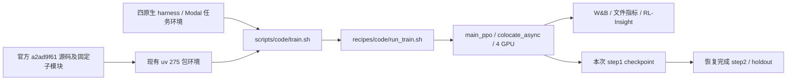

# 官方 Code 四卡基线

目标：先证明 XiaomiMiMo/verl 官方 Code 入口在当前服务器上完成真实更新、checkpoint、本次 checkpoint 恢复后的下一次更新及 holdout；之后继续 DSH 和 2+2 分池验收。用户已授权“先用官方的完整跑通”。

约束：README 指定 SFT 9B；模型总上下文 65536；训练 TP4、rollout TP2；四卡共享池；保持原版 GRPO/step-hash/评分器，训练核心零补丁。使用已验证的 uv 环境，不重建系统 CUDA/Torch。预算截止保持 2026-09-30T12:51:43.743Z，GPU 停机守护独立于训练。

文件：prepare_baseline.py 生成 launch/profile/source manifest；test_prepare_baseline.py 检查真实 Hydra compose 和官方 validator；operations 脚本仅负责部署、进程记录、监控和截止清理。接口为原版环境变量与 Hydra overrides；凭据只传私有文件路径。

验证顺序：固定源码 SHA/文件模式/子模块 → CPU 配置预检 → 四卡实际初始化与原生任务 → 梯度与参数更新 → 完整 checkpoint → 恢复后真实更新 → holdout/W&B/Insight 血缘核对。两次更新是官方最小闭环，不计作 DSH 全量验收。64K 配置与实际达到满长 64K 容量分别报告。

现状：已有扩展版本四卡初始化证据，官方版本真实更新尚为零。官方 logger 内置 wandb/file/rl_insight，默认 Code 脚本仅启用 console/tensorboard；必须显式配置并核对收到真实数据。
