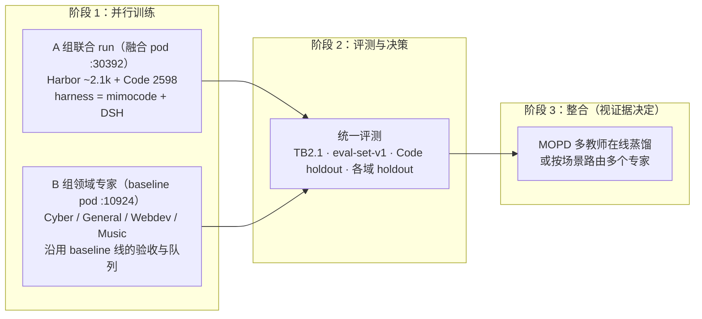

# 正式训练规划：Harbor（stage1 + 2000）× MiMo 五域

日期：2026-10-02 · 分支 `worktree-xdan-verl-fusion`（镜像分支 `xdan/fusion-a9f2985`）

**状态：用户已于 2026-10-02 批准方案 ③。** A 组首轮跑 100 步，harness 用 mimocode + DSH；B 组交给 baseline 会话。

## 1. 目标与成功标准

- 起点模型：`MiMo-V2.6-Distill-Qwen-9B`（SFT）。
- 主目标：在**独立评测**上明确超过 SFT 基线。
  - Terminal-Bench 2.1（89 题）：Harbor 数据源 README 定下的目标指标。
  - eval-set-v1（78 题）：Harbor 冻结评测集，附带基座在每题上的成功次数。
  - MiMo Code holdout100。
- 次目标：五域各自 holdout 上不低于 SFT，也就是不出现灾难性遗忘。
- 不算成功的情况：只有训练 reward 上升，holdout 没有提升；或者只提升了 harness 的格式遵循，没有提升解题能力。

## 2. 数据全景（已核实）

| 组 | 数据 | 训练 | 评测 / 保留 | runner / reward 契约 | 能否混合 harness |
|---|---|---:|---|---|---|
| **A. Agentic SWE / 终端** | Harbor stage1（ladderA，已审计） | 500 | val 8 | Code runner + `HarborEnvironment` | ✅ |
| | Harbor 全量池 batch1（审计中） | ≤ 2000，按审计通过数计 | — | 同上 | ✅ |
| | MiMo Code（已去掉 holdout） | 2598 | holdout100 | Code runner + `opensource-code` | ✅ |
| **B. 领域专家** | Cyber（ARVO） | 900 | 100 | ArvoAgentLoop（harness 写死） | ❌ |
| | General | 889 | 100 | GeneralAgentLoop + MCP + judge | ❌ |
| | Webdev | 1993 | 100 | WebdevAgentLoop + 分组视觉 grader | ❌ |
| | Music | 900 | 100 | 单轮，本地 scorer | 不适用 |
| 评测基准 | TB2.1 / SWE-bench Verified / eval-set-v1 | 0 | 89 / 500 / 78 | — | — |

A 组三份数据共用同一个 runner 和 reward 契约，可以混成一个数据集，并且能在任意 harness 上跑（任务 × harness 已在 GPU 上验证）。B 组的 verifier 和配套服务写死在各自的 AgentLoop 里，现在只能各域分开训练。

评测隔离：`data/eval-denylist.txt`（1275 条）在选题和转换两步都强制执行，命中即报错。

## 3. 方案对比与推荐

| 方案 | 做法 | 优点 | 风险 / 代价 |
|---|---|---|---|
| ① 单一大混合 run | 7 类数据放进一个 trainer，每行按 agent loop 分派 | 一次得到单个模型 | B 组需要先做 verifier 解耦重构；任一域的服务（judge、grader、K8s 替代后端）一抖，整步卡住；9B 上没有证据支持；冷启动成本最高 |
| ② 按顺序课程学习 | 同一模型逐域依次训练 | 工程简单 | 遗忘风险高；串行耗时最长 |
| **③ 推荐：A 组联合 + B 组专家 + 阶段 3 视证据整合** | 同契约的数据合在一起训，异契约的数据各自训，最后再决定是否用 MOPD 合并 | 每个 run 只依赖自己的基础设施，两台 pod 可以并行；和 MiMo 官方路线一致（9B 分域 GRPO，大模型用 MOPD 整合） | 最终多一步整合。MOPD 在 9B 上有负面先例（对方 S1 −0.172），所以阶段 3 必须先拿证据，不能默认要做 |

## 4. A 组联合 run 的规格（融合 pod）

- 数据：Harbor（stage1 500 + batch1 审计通过的题）与 Code 2598 拼成一个 parquet，每行保留各自的 `dataset_type`。按任务数自然配比，约 45:55。监控按来源拆分的 reward 和通过率；如果某个来源长期全对或全错，再调整权重。
- harness：`mimocode` + `DSH`（运行时 payload）。采用 `step-hash`，同一组内只用一种 harness，组内 baseline 干净，同时可以按 harness 对比效果。
- 算法：沿用 MiMo Code 配方。GRPO，N=8，`prompt-mean` 聚合，`norm_adv_by_std=False`，**DAPO 过滤开启**（冒烟里出现过全对组导致 grad=0），lr 1e-6，entropy 0，失败即拒收（infra 或缺失 reward 一律丢弃，不当 0 分训练）。
- 规模：batch 8 prompt × N8 = 64 条轨迹/步。并发 sandbox 32–48。上下文 64K（prompt 4K + response 60K）。
- 拓扑：4 卡 colocate_async，TP4，rollout TP2。这套已验证；separate_async 需要的有界采样器（`0fab9666`）还没挑过来，作为提升利用率的后续项。
- 步数和节奏：先跑 **100 步**，覆盖约 800 个 prompt，不到 1 个 epoch。每 10 步存一次 checkpoint，只保留 2 份（每份约 124GB）。每 25 步在独立 pod 或空档做一次评测。
- 预计耗时：按冒烟实测外推，每步约 25–40 分钟，100 步约 2–3 天。**需要先跑 5 步实测确认。**

### 预算（估算，需实测校准）

| 项 | 估算 |
|---|---|
| GPU（融合 pod，4×RTX PRO 6000，$8.36/h × 约 60h） | 约 $500 |
| Modal（6400 条轨迹 × 约 15 分钟 × 2 CPU sandbox） | 约 1600 sandbox·h，**需要以账单实测为准** |
| 评测（SFT 基线 + 每 25 步 × 4 次） | 约 $100–200 |

## 5. 开跑前的必要条件（按顺序）

1. [ ] batch1 审计完成，生成 `batch1/train.parquet`。
2. [ ] 合并 A 组数据集，并对合并结果再跑一次 deny-list 检查。
3. [ ] **SFT 基线评测**：TB2.1（镜像已有）、eval-set-v1（需要 build + 审计）、Code holdout100。没有基线就无法判断训练是否成功。
4. [ ] DSH 网关从 quick tunnel 换成稳定入口：Cloudflare 命名隧道或 RunPod 暴露端口，供多日运行使用。
5. [ ] 联合配置跑 5 步并验证 resume：实测步时、显存、Modal 并发和成本，再确定 100 步计划。
6. [ ] 每个 run 结束时做 Modal 成本核算和 sandbox 回收；checkpoint 保留策略（`MAX_ACTOR_CKPT_TO_KEEP=2`）。

## 6. B 组安排

- baseline 线（会话 `xdan-train-performance-verl-13`，pod :10924）已经在依次验收 Music、Cyber、Webdev、General，并配齐了 Modal 后端和 judge。**由它继续把这四域训成专家**，避免两条线重复投入。
- 融合线不重做这四域。只有当阶段 2 证据表明需要整合时，才把 baseline 线的专家权重（HF 格式）拿来做 MOPD 的 teacher；基座版本不同不影响把它们当 teacher。

## 7. 需要拍板的决策

1. 是否采用方案 ③（A 组联合 + B 组专家 + 阶段 3 视证据整合）？
2. A 组首轮跑 100 步、预算约 $500 GPU，加上实测后的 Modal 费用，可以吗？
3. 正式 run 的 harness 组合：`mimocode + DSH`，还是加入 MiMo 官方的 4 种白盒 harness？
4. B 组是否交给 baseline 线完成（需要和该会话协调）？
